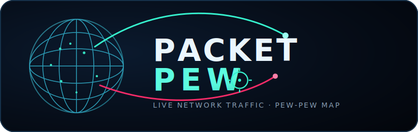
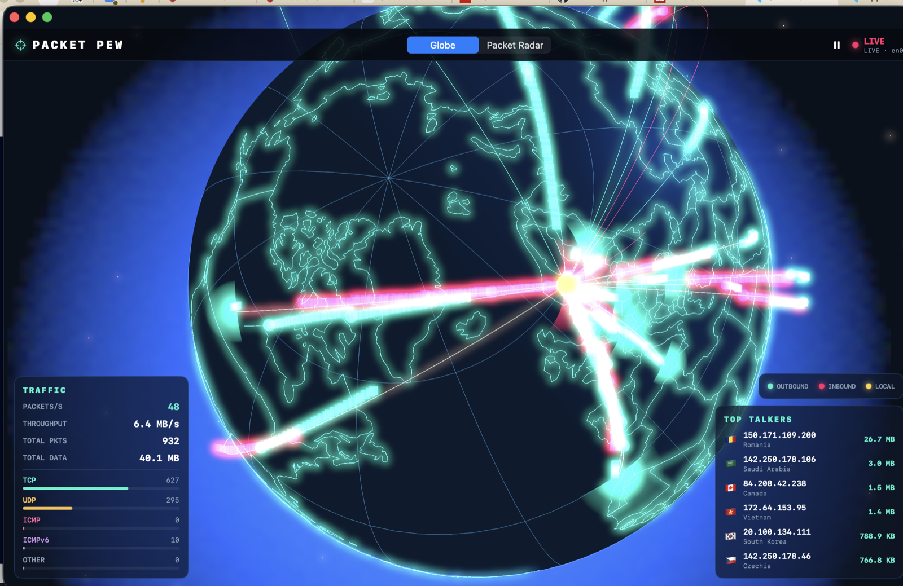

<p align="center">
  
</p>

<p align="center">
  <b>Packet Pew</b> turns your machine's live network traffic into an over-the-top
  “pew pew” threat map — a rotating 3D globe firing missiles between geolocated IPs,
  with a packet-radar mode alongside it.<br>
  <sub>macOS &amp; iOS · SwiftUI + SceneKit · real libpcap capture with a built-in demo fallback</sub>
</p>

---

A "pew pew map"-style network visualization for macOS (and iOS) — inspired by the
over-the-top threat maps security companies like to show off. Packet Pew taps your
machine's network traffic and renders it in two modes:

1. **Globe** — a rotating 3D globe (SceneKit) where every connection is fired as a
   glowing "missile" along a great-circle arc from source IP to destination IP,
   geolocated to the country of origin, with an exhaust trail and impact flash.
2. **Packet Radar** — a radar scope (SwiftUI Canvas) where packets are blips that
   shoot outward (outbound) or inward toward your machine at the center (inbound),
   colored per protocol, with a rotating sweep.

Switch between modes in the top bar. The HUD shows packet rate, throughput,
protocol breakdown, and the most active remote peers (with country flags).

<p align="center">
  
  <br>
  <sub>Live capture on <code>en0</code>: outbound (teal) and inbound (pink) missiles between geolocated IPs, with top talkers and protocol breakdown.</sub>
</p>

## Requirements

- macOS 14+ and the Xcode 16 / Swift 6.0 toolchain (tested with Swift 6.2 / Xcode 26).

## Running the app

### Demo mode (no privileges required)

```bash
swift run PacketPew
```

Without access to `/dev/bpf`, the app automatically falls back to a **simulated
traffic stream** so the visualization is always alive. The top bar then shows `DEMO`.

### Live capture (real traffic — requires root)

Packet capture via libpcap requires access to the BPF devices (`/dev/bpf*`). Either:

```bash
# Build first, then run the binary as root:
swift build -c release
sudo .build/release/PacketPew
```

…or grant your own user persistent access by installing **ChmodBPF** (ships with
Wireshark), then run without `sudo`. When capture succeeds the top bar shows `LIVE`
and which interface is in use (e.g. `LIVE · en0`).

The app automatically selects the default route's interface (the one that actually
reaches the internet — e.g. `en0`), rather than some arbitrary virtual Apple
interface. Override it with an environment variable if needed:

```bash
sudo PACKETPEW_IFACE=en1 .build/release/PacketPew
```

The console logs the chosen interface and packet counts so you can confirm capture:

```
PacketPew: LIVE capture on en0 (datalink 1) — set PACKETPEW_IFACE to override
PacketPew: captured 1843 packets, parsed 1720 IP flows
```

### In Xcode

```bash
open Package.swift
```

Select the `PacketPew` scheme and run (⌘R). For live capture in Xcode the app must
run with privileges; the CLI variant above is the easiest path.

## How it fits together

```
Sources/
  CPcap/              C bridge over libpcap (pcap_open_live / pcap_next_ex). macOS-only.
  PacketPewKit/       Shared, cross-platform library (all logic + UI):
    Models/           NetworkEvent, GeoPoint, protocol/direction
    Geo/              GeoLocator (ip-api.com + offline fallback), country centroids,
                      WorldMap (Natural Earth borders)
    Traffic/          PacketParser, SimulatedTrafficSource, PcapTrafficSource
    Engine/           TrafficEngine — picks the source, tracks stats, broadcasts events
    Views/            GlobeView/GlobeScene (SceneKit), RadarView (Canvas), HUD
  PacketPew/          Thin app shell (@main) for macOS.
```

- **Geolocation:** Private/LAN addresses map to the machine's own position
  (looked up via ip-api.com at startup, defaulting to Oslo). Public IPs are
  resolved against ip-api.com and cached; offline, a deterministic country
  fallback is used. Lookups are non-blocking — events appear immediately with an
  approximate location and are refined in the background. Accuracy is at the
  country level, as specified.
- **Map:** Country borders are drawn from Natural Earth 110m data (public domain),
  bundled offline as a resource (`Resources/world.json`).
- **Performance:** Live capture is throttled per remote IP (~120 ms) and the globe
  caps the number of concurrent arcs, so heavy traffic doesn't drown the view.

## iOS

The entire library (`PacketPewKit`) is cross-platform and builds for iOS 17+.
The globe and radar views work as-is. **Live capture is macOS-only** — iOS has no
`/dev/bpf`, so `PcapTrafficSource` is gated behind `#if os(macOS)` and iOS uses the
demo stream. To make an iOS app: create an iOS app target in Xcode that depends on
`PacketPewKit` and use `RootView()` as its root view. (Real traffic on iOS would
require a Network Extension / Packet Tunnel with the corresponding entitlements and
a paid developer account.)

## Privacy

In demo mode everything is generated locally. In live mode, only your remote IPs
are sent to ip-api.com for geo lookups (cached). Set `GeoLocator(useOnline: false)`
in `TrafficEngine` to keep everything offline (then only the country fallback is used).

## Self-test

```bash
swift run PacketPew --selftest
```

Runs a non-graphical smoke test of packet parsing, geo fallback,
scene/geometry construction, world-map loading, and the simulated stream.
